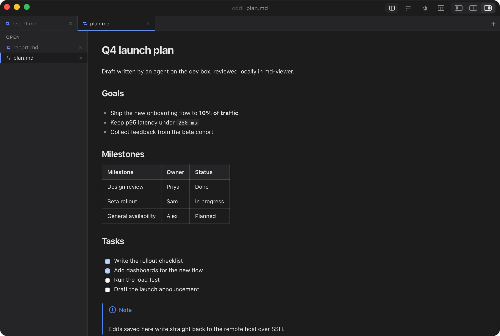
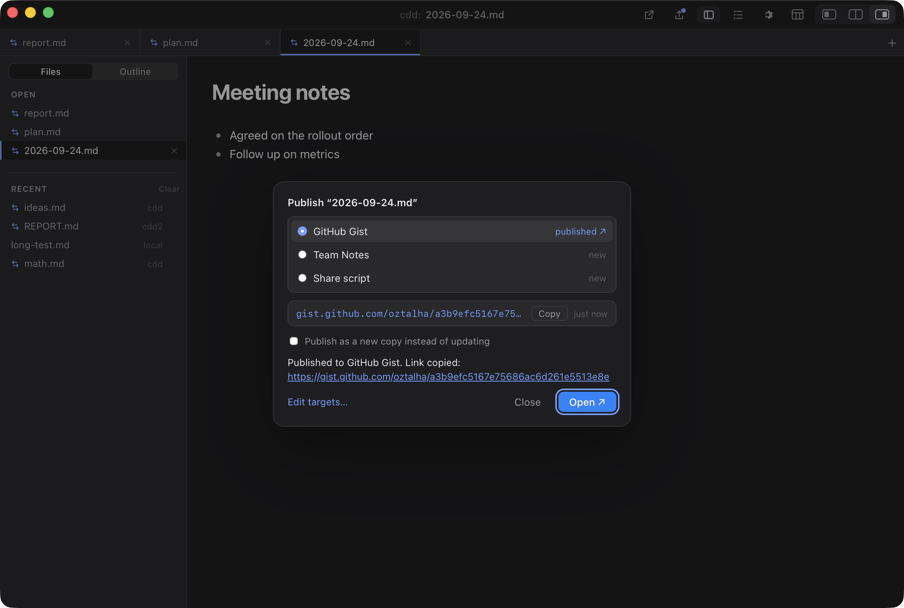
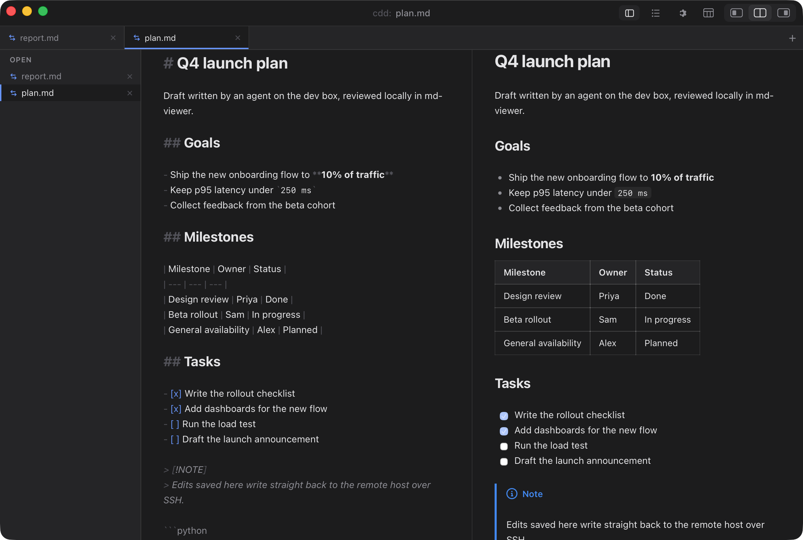
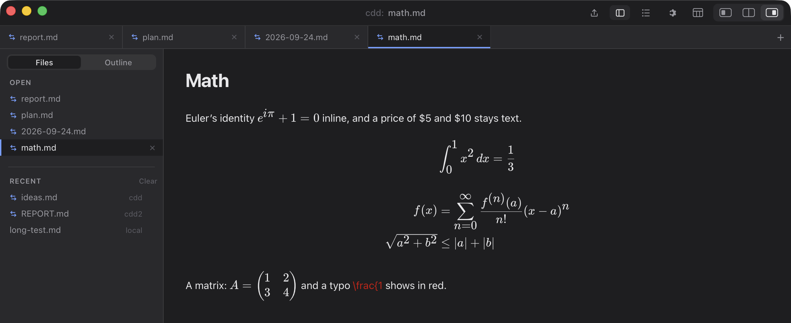
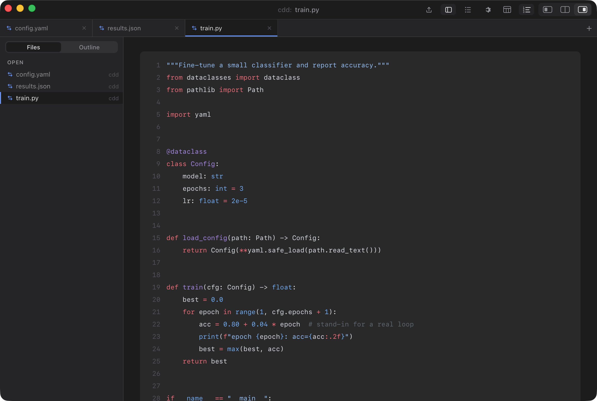
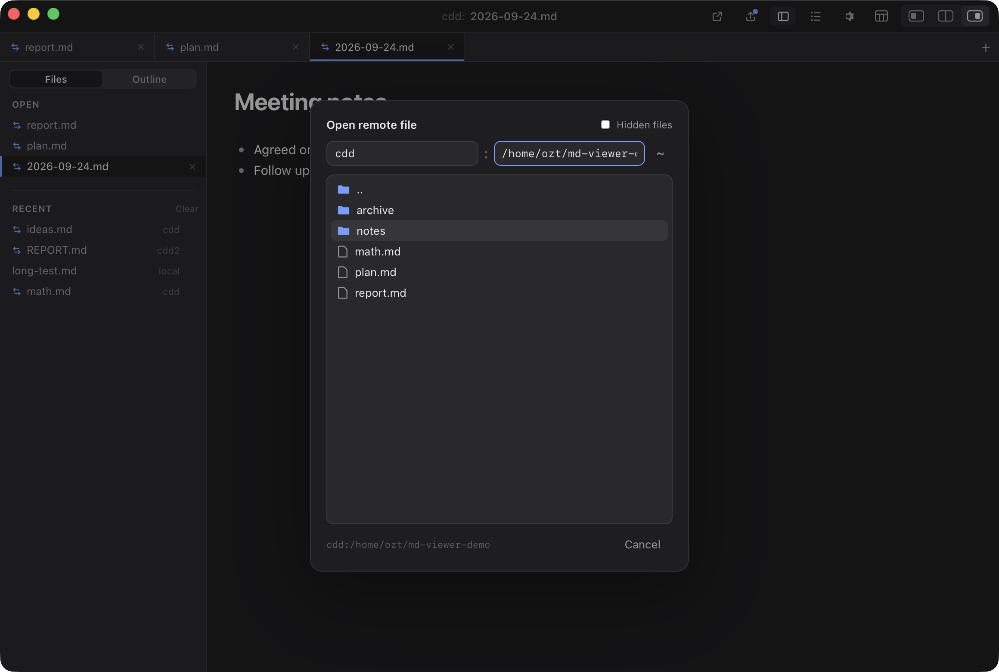

# md-viewer

A fast, native-feeling markdown editor and viewer for macOS — **for files on
your Mac or on any machine you can `ssh` to.**

Open, edit and save markdown on a dev box, a cloud desktop, or the machine your
coding agent runs on, as if it were local. It doubles as a lightweight remote
file browser: browse folders, copy paths, drag files from Finder to copy them
onto the remote machine, and download files back. md-viewer uses your system `ssh`, so
your `~/.ssh/config` aliases, keys, jump hosts and `ProxyCommand` just work —
nothing to install on the remote side.



## Install (Apple Silicon)

**[Download the latest DMG](https://github.com/oztalha/md-viewer/releases/latest/download/Markdown_aarch64.dmg)**
([release notes](https://github.com/oztalha/md-viewer/releases/latest)), open
it, and drag **Markdown.app** to Applications.

**First launch:** the app isn't notarized by Apple yet, so macOS will say it
can't verify it. Click **Done**, then open **System Settings → Privacy &
Security**, scroll to **Security**, and click **Open Anyway** next to
*"Markdown" was blocked*. You only do this once.

If your Mac doesn't offer Open Anyway (some company-managed Macs hide it), run
this once instead:

```sh
xattr -dr com.apple.quarantine /Applications/Markdown.app
```

Or [build it yourself](#build-from-source). See [CHANGELOG.md](CHANGELOG.md)
for what's new in each version.

## Features

**Remote files over SSH**
- Browse a remote machine and open files with **Open Remote…** (⇧⌘O); save new
  or local documents to any host with **Save to Remote…** (⇧⌘S)
- Edits save straight back over SSH, atomically; files that change on the
  remote machine (or locally) reload on their own, and **⌘R** reloads by hand
- **Copy files to a remote machine:** drag files or folders from Finder onto the
  remote browser to copy them into the folder it shows (any file type, via
  `scp`); it asks before replacing anything. Download goes the other way: click
  a non-text file (zip, image, PDF, …) or right-click → **Download…**
- Open from the terminal (`mdv host:/path/file.md`) or a clickable
  `mdviewer://` link — handy when an agent on the remote box writes a report

**Tabs**
- Every file opens as a tab; drag to reorder, **⌘1–9** to jump, **⌃Tab** to cycle
- Sidebar with **Files** (open and recent files, local or remote; drag open files to reorder, right-click to **Pin** the ones you keep coming back to) and **Outline** tabs (⇧⌘F / ⇧⌘0); the title bar shows `host:` for remote files

**Editing and preview**
- Editor, split, or preview per document; **⇧⌘V** flips between editor and
  preview and keeps your place
- Semi-WYSIWYG editing: `**bold**` renders bold with the markers still visible
- GitHub-flavored preview: tables, task lists, alerts, footnotes, highlighted
  code, images; CSV/TSV files open as tables
- **Code and JSON files** open highlighted, like a fenced block (Python,
  JS/TS, shell, Rust, Go, Java, YAML, TOML, SQL, …); JSON is pretty-printed,
  and JSONL/NDJSON shows one block per record
- **Line numbers** in the editor and in code blocks (⇧⌘N)
- **`file:LINE` jumps to the line** — paste or click `notes.md:33` or
  `host:/path/run.py:120` (as printed by tools and agents) and it opens there
- LaTeX math with KaTeX: `$inline$`, `$$display$$`, and ```` ```math ```` blocks
- Highlight passages and attach notes in the preview
- Format with Prettier, export to HTML, light and dark themes

**Publishing**
- **Publish…** (⇧⌘P) shares a document as a GitHub Gist, or to any place you add
  through a local MCP server or a command; republishing updates the same link.
  See [docs/PUBLISHING.md](docs/PUBLISHING.md).









## Remote files



**Open Remote…** (⇧⌘O) opens a file browser for a remote host. Type any host you
can `ssh` to (an alias from `~/.ssh/config` works), click through folders, and
click a file to open it. You can also paste `host:/path/to/file.md` into the path
bar. **Save to Remote…** (⇧⌘S) uses the same browser with a filename field; after
that the document is remote, so ⌘S writes back to that host. The browser
remembers your last host and the last folder on each host.

**Copying files over:** with the remote browser open on a folder, drag files or
folders from Finder onto it. They're copied there with `scp` (so your SSH
config applies, and any file type works); if a name already exists, it asks
before replacing. The copy icon next to the path copies the folder's path.
To download, click a file that isn't text (archives, images, PDFs, …) or
right-click any file or folder → **Download…**: a save dialog picks where it
goes, and Finder shows it when done. Rename and delete are left to the
terminal on purpose.

**⇧⌘C** copies the document's path — the bare path by default, or `host:/path`
if you turn on *Copy path includes host* in Settings.

Set a **default host** in Settings (⌘,) and you can leave the host out:
`mdv :/path/to/file.md` or `mdviewer://open?path=/abs/path`.

To have an agent on the remote box hand you a link it can open, print either:

```
mdviewer://open?host=<your-ssh-alias>&path=/abs/path/to/file.md
mdv <your-ssh-alias>:/abs/path/to/file.md
```

Append `:LINE` (or `&line=33` to the link) to open at a line.

## Keyboard shortcuts

<details>
<summary>All shortcuts (most are rebindable in Settings, ⌘,)</summary>

| Action | Keys |
| --- | --- |
| Settings | ⌘, |
| New / Open / Save | ⌘N / ⌘O / ⌘S |
| Save As… (local) | ⌥⌘S (⌘S on a new doc asks where to save) |
| Open Remote… / Save to Remote… | ⇧⌘O / ⇧⌘S |
| Reload | ⌘R |
| Open published page | ⇧⌘L |
| Copy path | ⇧⌘C |
| Publish… | ⇧⌘P |
| Export as HTML… | ⇧⌘E |
| Go to tab 1–9 | ⌘1 … ⌘9 |
| Next / previous tab | ⌃Tab / ⌃⇧Tab, or ⇧⌘] / ⇧⌘[ |
| Close tab | ⌘W |
| Editor · Split · Preview | ⇧⌘7 · ⇧⌘8 · ⇧⌘9 |
| Toggle editor ⇄ preview | ⇧⌘V |
| Sidebar: Files · Outline | ⇧⌘F · ⇧⌘0 |
| Line numbers on / off | ⇧⌘N |
| Select all | ⌘A |
| Paste and match style | ⌥⇧⌘V |
| Zoom in / out / reset | ⌘+ / ⌘− / ⌘0 |
| Bold / Italic / Code / Strike / Link | ⌘B / ⌘I / ⌘E / ⇧⌘X / ⌘K |
| Toggle task checkbox | ⌘↩ |
| Format document | ⇧⌥F |
| Next / previous table cell | Tab / ⇧Tab |

</details>

## Command-line launcher (`mdv`)

`scripts/mdv` opens files from the terminal. It runs the locally compiled
release binary (building it on first use), which also works on machines where
binary-authorization tools such as Santa block unsigned `.app` bundles.

```sh
ln -s "$PWD/scripts/mdv" ~/bin/mdv      # put it on your PATH
mdv notes.md                            # open a local file
mdv devbox:/home/me/plan.md             # open over SSH
```

Override the source location with `MDV_DIR`; force a rebuild with `mdv --rebuild`.

## Midnight Commander integration

Browse local and remote trees in Midnight Commander and open markdown in
md-viewer with a keypress. See
[docs/midnight-commander-integration.md](docs/midnight-commander-integration.md).

## Build from source

Requires [Bun](https://bun.sh) and a Rust toolchain.

```sh
bun install
bun run tauri dev      # run in development
bun run tauri build    # → src-tauri/target/release/bundle/macos/Markdown.app (+ .dmg)
```

Contributing: see [AGENTS.md](AGENTS.md) and [docs/ARCHITECTURE.md](docs/ARCHITECTURE.md). Releases are built automatically when a version tag is pushed; see
[docs/RELEASING.md](docs/RELEASING.md).

Built with Tauri 2 and CodeMirror 6.
